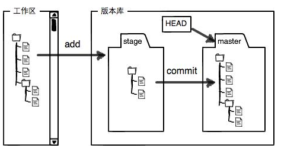

# Git系统的组成
### 工作区(Working Directory)
  就是执行`git init`的那个目录
### 版本库(Repository)
  工作区有一个隐藏目录`.git`，这个不算工作区，而是Git的版本库。

  Git的版本库里存了很多东西，其中最重要的就是称为`stage`（或者叫index）的暂存区，还有Git为我们自动创建的第一个分支`master`，以及指向`master`的一个指针叫`HEAD`.
## Git图解

# Git的基本命令

安装完成git后，输入以下命令设置用户名和邮箱

    $ git config --global user.name "Your Name"
    $ git config --global user.email "email@example.com"

`--global`参数，表示你这台机器上所有的Git仓库都会使用这个配置，当然也可以对某个仓库指定不同的用户名和邮箱。

新建一个目录，通过`git init`命令把这个目录变成Git可以管理的仓库。

新建一个文件例如 *a.txt* ，写入一些内容之后，用`git add`命令把文件添加到暂存区

    $ git add a.txt

如果有多个文件，可以直接用" . "来表示，就不用把每个文件名都写上了

    $git add .

用`git commit`命令把暂存区的所有文件提交到当前分支

    $ git commit -m "first commit"

`-m`后面输入的是本次提交的说明，方便以后从记录里找到某次提交的记录。

`git status`命令用来查看当前状态

`git diff <file>`命令查看文件差异

`git log`命令显示从最近到最远的提交记录

在Git中，用`HEAD`表示当前版本，上一个版本是`HEAD^`，上上个版本就是`HEAD^^`，当然往上版本比较多的话，可以用`HEAD~100`来表示。

回退一个版本用`git reset`命令

    $ git reset --hard HEAD^

`git reflog`可以查看每一次版本改动的记录，主要是看前面的id，有了这个id，就可以随意前进或后退版本了。

    $ git reset --hard 371b075

## Git的撤销和删除
工作中，几种需要撤销修改的场景：

场景1：当需要撤销工作区文件的修改，该文件在修改之前已经提交到版本库，修改后没有add到暂存区，用`git checkout -- file`命令（--前后都有空格）

场景2：当文件已经add到了暂存区，又做了修改，想撤销用`git reset HEAD file`命令回到场景1，再按场景1操作。

场景3：文件已经提交到了版本库，用`git reset --hard HEAD^`来回退版本

用`git rm`命令删除一个文件，如果该文件已经提交到了版本库，那就在`git rm`之后再`git commit -m "remove file"`一下。

# 链接远程仓库(Github)
要链接Github，需要ssh密钥。

1.在用户主目录下，先看看有没有.ssh目录，如果有，再看看这个目录下有没有id_rsa(私钥)和id_rsa.pub(公钥)这两个文件，如果没有，则创建SSH key：

    $ ssh-keygen -t rsa -C "email@example.com"
然后一路回车，使用默认值即可。

2.在Github的账户设置里的SSH and GPG keys里把id_rsa.pub里的内容复制过去。

3.将本地库和远程库关联

    $ git remote add origin git@github.com:longteng8364/new-one.git
4.把本地库的内容推送到远程库，用`git push`命令，实际上是把当前分支master推送到远程库

    $ git push -u origin master
由于远程库是空的，我们第一次推送master分支时，用了-u参数，这样就会把本地的master分支和远程的master分支关联起来，在以后推送或拉取时就可以简化命令。

从现在起，只要本地做了提交，就可以通过命令`$ git push origin master`把本地master分支的最新修改推送到远程库。

如果在GitHub创建仓库的时候勾选了`Initialize this repository with a README`,那推送的时候会报一个错，这时应该先通过以下命令合并一下：

    $ git pull --rebase origin master

## 从远程库克隆

    $ git clone git@github.com:longteng8364/new-one.git

# 分支
创建一个dev分支

    $ git branch dev

切换到dev分支

    $ git checkout dev

可以用下面命令来合并上面两条命令

    $ git checkout -b dev

然后，用`git branch`命令查看当前分支

    $ git branch
    * dev 
      master

把dev分支的内容合并到master分支上

    $ git merge dev

`git merge`命令用于合并指定分支到当前分支。

合并完成后，就可以删除dev分支了

    $ git branch -d dev

如果一个分支没有被合并就准备舍弃，Git会有提示，这时可以加上参数-D强制删除

    $ git branch -D dev

# 多人协作
多人协作的工作模式通常是这样的：
1. 首先，可以试图用`git push origin branch-name`推送自己的修改；
2. 如果推送失败，则因为远程分支比你的本地更新，需要先用`git pull`试图合并；
3. 如果合并有冲突，则解决冲突，并在本地提交；
4. 没有冲突或者解决掉冲突后，再用`git push origin branch-name`推送

如果`git pull`提示 "no tracking information"，则说明本地分支和远程分支的链接关系没有创建，用命令

    $ git branch --set-upstream branch-name origin/branch-name

查看远程库信息，用`git remote -v`命令

# 标签
在Git中打标签，先切换到需要打标签的分支上

    $ git checkout master

然后，用`git tag <tagname>`就可以打一个标签

以下命令可以指定标签信息

    $ git tag -a <tagname> -m "some discription"

可以用`git tag`命令查看所有标签

命令`git push origin <tagname>`可以推送一个本地标签；

命令`git push origin --tags`可以推送全部未推送过的本地标签；

命令`git tag -d <tagname>`可以删除一个本地标签

命令`git push origin :refs/tags/<tagname>`可以删除一个远程标签

# 配置Git
1.配置一些命令简写

    $ git config --global alias st status

这样，以后敲`git st`就相当于`git status`

2.忽略特殊文件

在Git工作区的根目录下创建一个`.gitignore`文件，把要忽略的文件名填进去，这些文件就不会被提交了。

